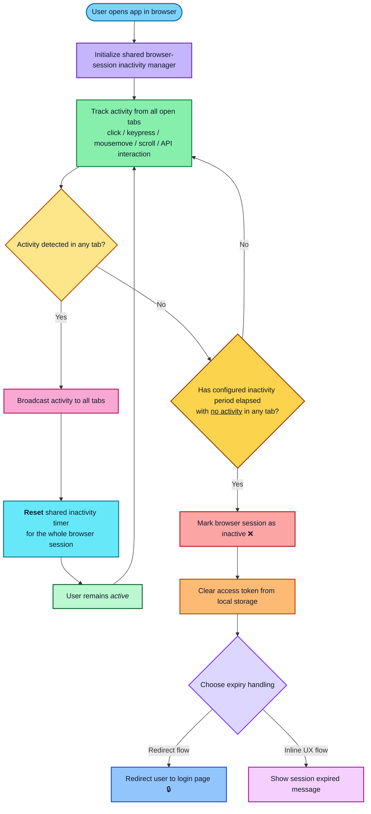
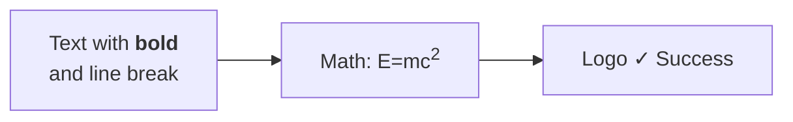

## Comprehensive HTML & Special Character Handling

**The Solution**: The app now features **advanced multi-strategy rendering** with comprehensive HTML support, special character handling, and robust fallback mechanisms!

### What's Supported

#### HTML Tags in Labels
You can use these HTML tags for rich formatting:
- ` `, ` `, ` ` - Line breaks
- `<b>`, `<strong>` - Bold text
- `<i>`, `<em>` - Italic text  
- `<u>` - Underlined text
- `` - Superscript
- `` - Subscript
- `` - Generic inline container

#### Special Characters & Unicode
Full support for:
- **Emoji**: 🚀 ✨ ⭐ ❤️ ✓ ✗
- **Math symbols**: ∑ ∫ √ ≈ × ÷
- **International**: äöü, 日本語, العربية
- **Special**: © ® ™ ° § ¶

#### Safe Automatic Processing
- HTML entities properly encoded
- XSS protection via tag sanitization
- Line endings normalized
- Whitespace trimmed
- BOM removed automatically

### Example - Rich Formatting:

## How It Works

### Multi-Strategy Rendering
The engine uses **6 intelligent fallback strategies** to ensure your diagram renders:

1. **Sanitized HTML** - Safe HTML tags only, dangerous content filtered
2. **Escaped Characters** - HTML entities properly encoded  
3. **Original Source** - Tries your exact input with HTML enabled
4. **Stripped HTML** - Removes all tags as compatibility fallback
5. **Plain Text Mode** - Disables HTML rendering completely
6. **Final Attempt** - Last resort with original source

If one strategy fails, the next is automatically tried until one succeeds!

### Intelligent Diagram Detection
The system automatically detects your diagram type and applies optimal configurations:
- **Flowcharts/Graphs**: Node spacing, padding, rounded corners
- **Sequence Diagrams**: Actor mirroring, message margins, wrapping
- **Gantt Charts**: Timeline styling, section formatting
- **State Diagrams**: Transition styling, composite states
- And 10+ other diagram types!

### Built-in Validation
Before rendering, the system can validate your syntax:
- Checks for unmatched quotes
- Detects unclosed HTML tags
- Validates diagram type syntax
- Provides helpful error messages
- Suggests fixes for common issues

## Security & Safety

### XSS Protection
Dangerous HTML is automatically sanitized:
- Script tags → converted to visible text
- Event handlers → stripped
- Style tags → sanitized
- Only safe formatting tags allowed

This ensures your diagrams are both feature-rich AND secure.

## Best Practices

### ✅ Recommended:

### ⚠️ Tips for Complex Content:
- Use double quotes for labels with special characters
- Close all HTML tags: `<b>text</b>` not `<b>text`
- Escape ampersands: `&amp;` instead of `&`
- Use HTML entities for `<`, `>`: `&lt;`, `&gt;`

## Technical Details

See [MERMAID_ROBUSTNESS.md](./MERMAID_ROBUSTNESS.md) for complete technical documentation including:
- Detailed rendering pipeline
- All supported diagram types
- Advanced troubleshooting
- Performance optimizations
- Security model
- API reference

## Error Handling

When rendering fails, you'll receive:
- ✅ Detected diagram type
- ✅ Specific error message
- ✅ Which strategy failed and why
- ✅ Common issue suggestions
- ✅ Line-specific feedback

This helps you quickly identify and fix any syntax issues!