# Mermaid Edge Cases - Quick Reference

This guide shows challenging scenarios that Mermaid Flow Studio handles gracefully.

## 1. HTML Tags in Labels

### Basic Formatting
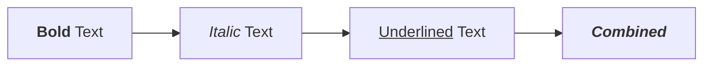

### Scientific Notation
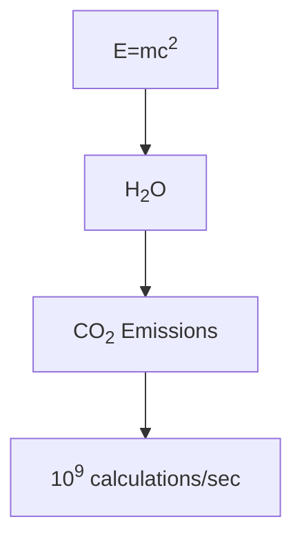

### Multi-line with Formatting
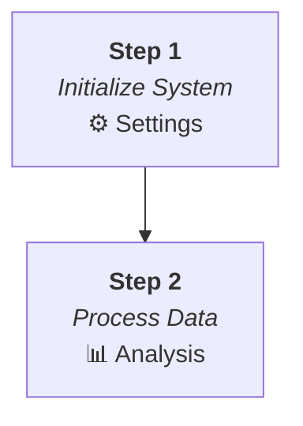

## 2. Special Characters

### Quotes in Labels
```mermaid
flowchart LR
    A["User says: \"Hello World\""] --> B['Response: "OK"']
    B --> C["Status: 'Active'"]
```

### Mathematical Operators
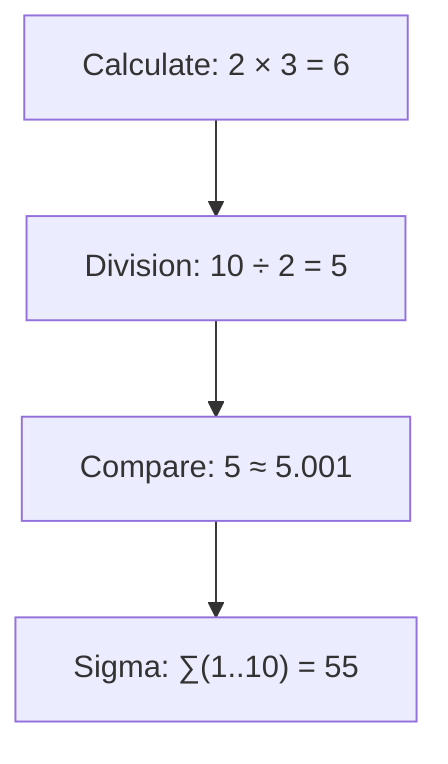

### Currency & Symbols
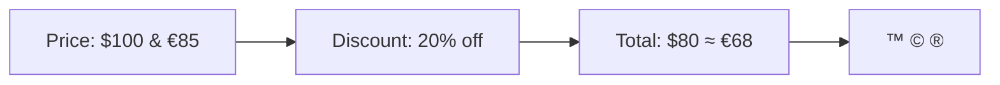

## 3. Unicode & Emoji

### Status Indicators
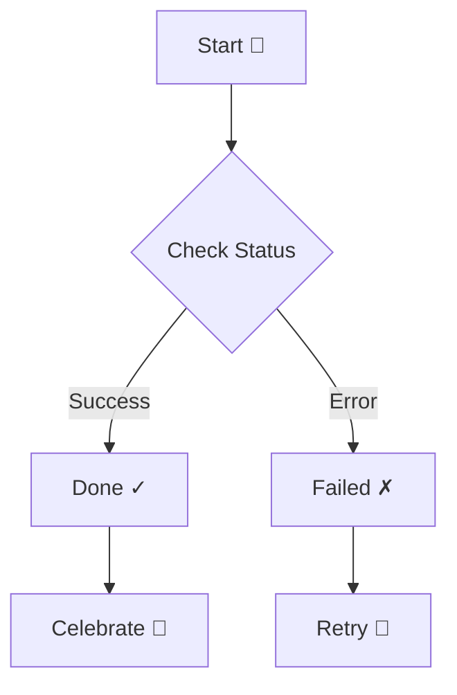

### International Characters
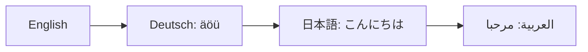

### Progress States
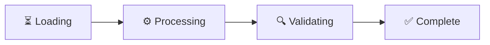

## 4. Complex Labels

### API Endpoints
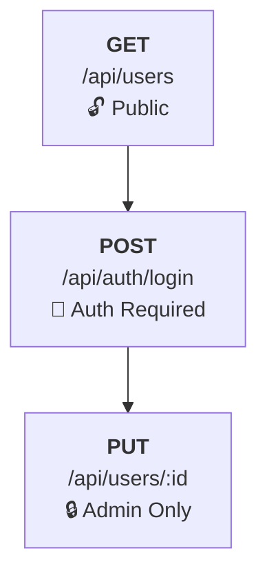

### Code Snippets
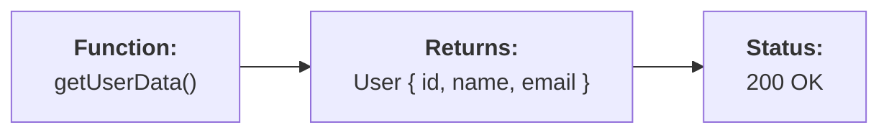

### Temperature & Units
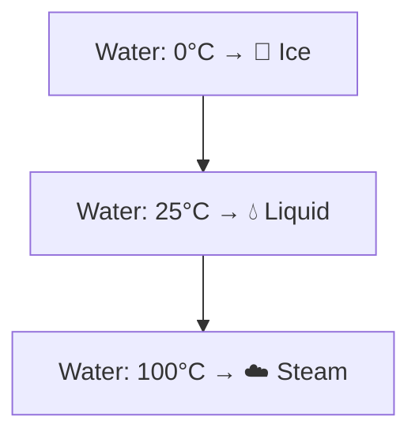

## 5. Nested Structures

### Subgraphs with HTML
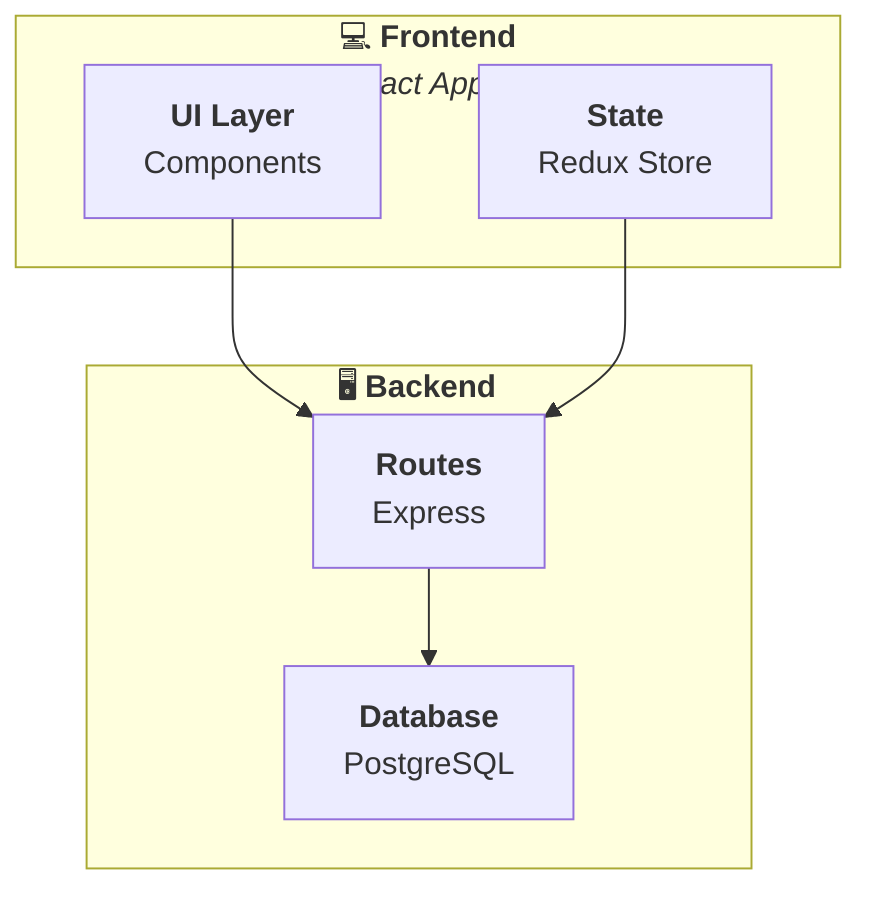

## 6. Mixed Content

### Business Process
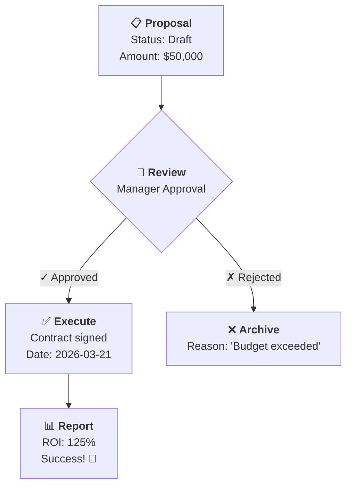

### Technical Workflow
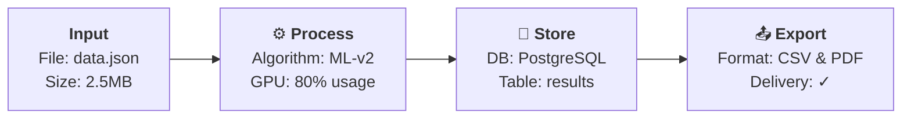

## 7. Error Handling Examples

### Recoverable Issues

#### Before (Would break):
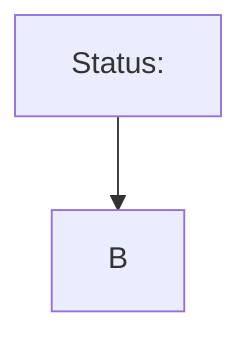

#### After (Auto-fixed):
The system automatically encodes `<` as `&lt;` to prevent breaking.

#### Before (Would break):
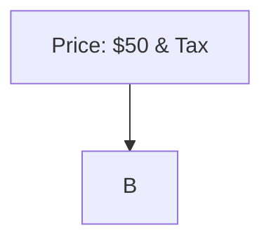

#### After (Auto-fixed):
The system encodes `&` as `&amp;` when needed.

## 8. Different Diagram Types

### Sequence Diagram with HTML
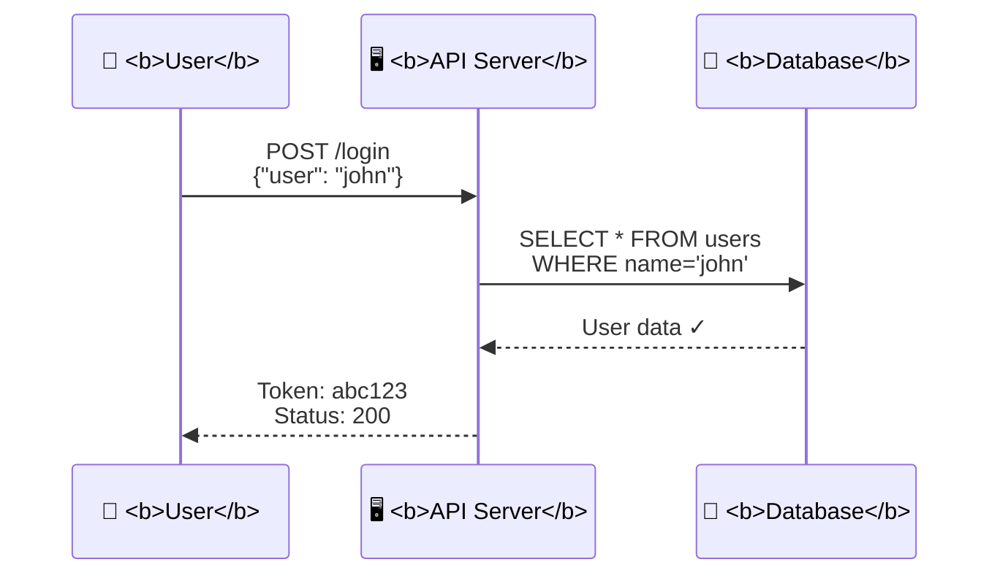

### State Diagram with Emoji
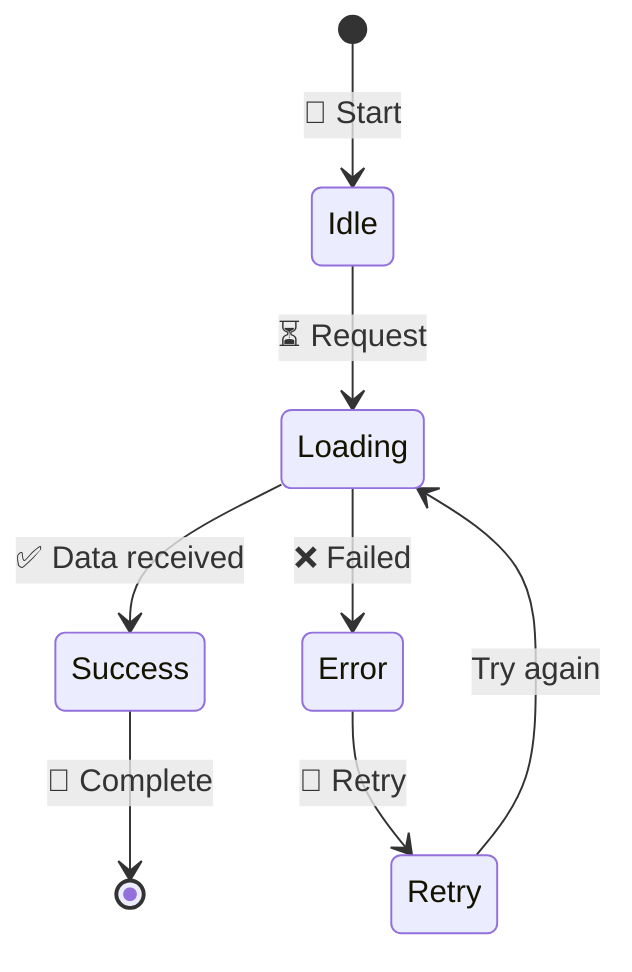

### Gantt Chart with Special Chars
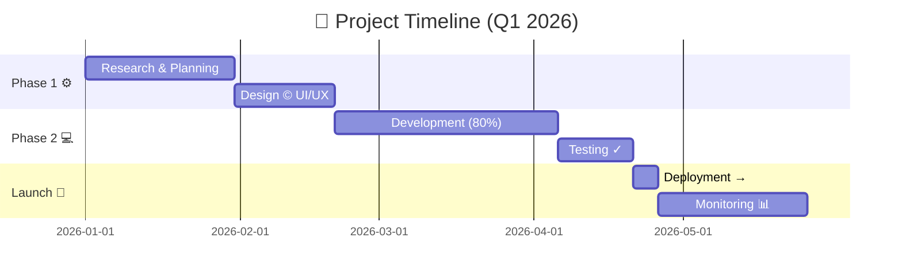

## 9. Accessibility Features

### ARIA Labels Automatic
All rendered diagrams include:
- `role="img"`
- `aria-label="Rendered Mermaid diagram"`
- Proper SVG structure
- Semantic markup

### Screen Reader Friendly
```mermaid
flowchart LR
    A["Step 1:<br/>User Authentication ✓"] 
    --> B["Step 2:<br/>Data Validation ✓"]
    --> C["Step 3:<br/>Process Complete ✓"]
```

## 10. Performance Edge Cases

### Large Labels
```mermaid
flowchart TD
    A["<b>Long Description</b><br/>This is a very long description that includes multiple lines of text with <i>formatting</i> and <b>emphasis</b> and even some emoji 🚀 to test how the system handles larger content blocks without breaking or causing performance issues."]
    --> B["<b>Another Long Node</b><br/>With lots of content<br/>Line 3<br/>Line 4<br/>Line 5"]
```

### Many Special Characters
```mermaid
flowchart LR
    A["∑∫√≈×÷±∞°§¶†‡©®™¢£¥€"] 
    --> B["αβγδεζηθικλμνξοπρστυφχψω"]
    --> C["ÀÁÂÃÄÅÆÇÈÉÊËÌÍÎÏ"]
```

## Tips for Success

1. **Always close HTML tags**: `<b>text</b>` not `<b>text`
2. **Use quotes for complex labels**: `["text with <special> chars"]`
3. **Test incrementally**: Add complexity gradually
4. **Check error messages**: They provide specific guidance
5. **Use validation**: `validateMermaidSyntax()` before rendering
6. **Escape when needed**: `&lt;` `&gt;` `&amp;` `&quot;`

## What's Handled Automatically

✅ BOM removal
✅ Line ending normalization
✅ Whitespace trimming
✅ HTML entity encoding
✅ XSS prevention
✅ Fallback strategies (6 levels)
✅ Diagram type detection
✅ Character encoding preservation
✅ SVG accessibility
✅ Error recovery

---

For complete technical documentation, see [MERMAID_ROBUSTNESS.md](./MERMAID_ROBUSTNESS.md)
