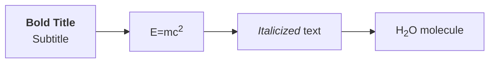
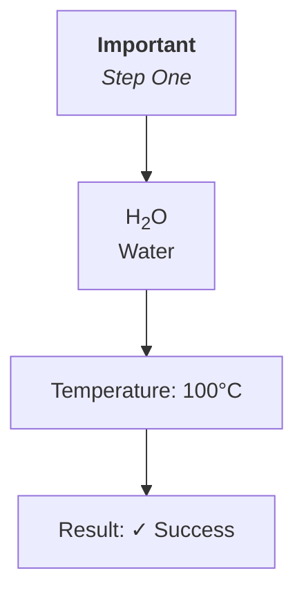
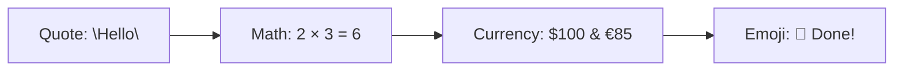
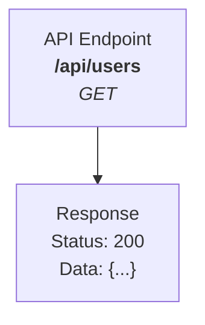

# Mermaid Rendering Robustness & Versatility

## Overview
This document explains the comprehensive safeguards and fallback strategies implemented to ensure Mermaid diagrams render correctly regardless of content complexity, HTML tags, special characters, or diagram type.

## Key Features

### 1. **Multi-Strategy Rendering Attempts**
The system tries multiple rendering strategies in order of preference:

1. **Sanitized HTML** - Allows safe HTML tags (`<br>`, `<b>`, `<strong>`, `<i>`, `<em>`, `<u>`, `<sup>`, `<sub>`, `<span>`)
2. **Escaped Special Characters** - HTML entities properly encoded
3. **Original Source** - Tries the raw input with HTML support
4. **Stripped HTML** - Removes all HTML tags as fallback
5. **No HTML Labels** - Disables HTML rendering entirely
6. **Complete Fallback** - Final attempt with original source and no HTML

This ensures that even if one strategy fails, the diagram can still render successfully.

### 2. **HTML Content Handling**

#### Safe HTML Tags
The following tags are allowed and will render properly:
- `<br>`, `<br/>`, `<br />` - Line breaks
- `<b>`, `<strong>` - Bold text
- `<i>`, `<em>` - Italic text
- `<u>` - Underlined text
- `<sup>` - Superscript
- `<sub>` - Subscript
- `<span>` - Generic inline container

#### Dangerous Tag Prevention
Potentially harmful tags are automatically sanitized by encoding them as text:
- Script tags are converted to visible text
- Style tags are sanitized
- Event handlers are removed
- This prevents XSS attacks while allowing formatting

#### Example Usage:


### 3. **Special Character Management**

#### Automatic Handling
- **BOM (Byte Order Mark)**: Automatically removed
- **Line Endings**: Normalized (CRLF → LF)
- **Non-breaking Spaces**: Converted to `&nbsp;`
- **Ampersands**: Escaped to `&amp;` when not already encoded
- **Whitespace**: Trimmed and normalized

#### Unicode & Emoji Support
Full support for:
- Emoji characters: 🚀 ✨ ⭐ ❤️
- International characters: äöü, 日本語, العربية
- Mathematical symbols: ∑ ∫ √ ≈
- Special symbols: © ® ™ ° §

### 4. **Diagram Type Detection**

The system automatically detects the diagram type and applies appropriate configurations:

| Diagram Type | Features |
|-------------|----------|
| **Flowchart/Graph** | Node spacing, rank spacing, padding, rounded corners |
| **Sequence** | Actor mirroring, message margins, text wrapping |
| **Gantt** | Section styling, date formatting, grid lines |
| **Class** | Relationship styling, member visibility |
| **State** | Transition styling, composite states |
| **ER** | Relationship cardinality, entity styling |
| **Pie** | Customized color palette |
| **Journey** | Task styling, actor coloring |
| **Git Graph** | Commit styling, branch colors |
| **Mindmap** | Hierarchical styling |
| **Timeline** | Event styling, chronological layout |

### 5. **Error Handling & Debugging**

#### Comprehensive Error Messages
When rendering fails, you receive:
- Detected diagram type
- Primary error message
- All attempted strategies with their errors
- Common issue suggestions
- Specific line information when available

#### Built-in Validation
Use `validateMermaidSyntax()` to check diagrams before rendering:
```typescript
const result = await validateMermaidSyntax(source);
if (!result.valid) {
  console.error(result.error);
}
```

#### Diagnostic Suggestions
Use `getDiagramSuggestions()` to get hints about potential issues:
```typescript
const suggestions = getDiagramSuggestions(source);
suggestions.forEach(s => console.log(s));
```

Common checks include:
- Unmatched quotes
- Unclosed HTML tags
- Missing diagram type declaration
- Invalid special characters
- Mixed arrow syntax styles

### 6. **Security Configuration**

#### Security Level: Loose
Changed from "strict" to "loose" to allow:
- HTML rendering in labels
- External links (with proper validation)
- More complex SVG features

This is safe because:
- HTML is sanitized before rendering
- Only safe tags are allowed
- Event handlers are stripped
- Scripts are blocked

### 7. **SVG Post-Processing Enhancements**

After Mermaid generates the SVG, additional processing ensures:

1. **XML Validation**: Checks for parser errors
2. **Proper Namespaces**: Adds xmlns and xlink for compatibility
3. **Accessibility**: Sets ARIA labels and roles
4. **Text Readability**: Ensures consistent font rendering
5. **ForeignObject Support**: Handles HTML content in SVG
6. **Error Recovery**: Graceful fallback if serialization fails

### 8. **Performance Optimizations**

- **Render Queue**: Sequential rendering prevents race conditions
- **Deterministic IDs**: Consistent rendering across attempts
- **Cached Parser**: DOMParser reused for efficiency
- **Off-screen Rendering**: Hidden render host prevents visual flickering

## Best Practices

### ✅ DO:
- Use double quotes for labels with special characters
- Close all HTML tags properly
- Use `<br/>` for line breaks
- Escape ampersands as `&amp;`
- Specify diagram type on first line
- Test with `validateMermaidSyntax()` before rendering

### ❌ DON'T:
- Mix different quote styles inconsistently
- Use script or style tags
- Leave HTML tags unclosed
- Use raw `<` or `>` in labels (use `&lt;` `&gt;`)
- Assume all diagram types support HTML labels
- Rely on browser-specific features

## Examples

### Example 1: HTML Formatting


### Example 2: Special Characters


### Example 3: Complex Labels


## Troubleshooting

### Issue: Diagram won't render
**Solution**: Check error message for specific strategy failures. Most common issues:
- Syntax errors in diagram definition
- Unmatched quotes or brackets
- Invalid arrow syntax for diagram type

### Issue: HTML tags appear as text
**Solution**: Ensure:
- `htmlLabels` is enabled (it is by default)
- Tags are in the allowed list
- Tags are properly closed

### Issue: Special characters break rendering
**Solution**: Use HTML entities:
- `&amp;` for &
- `&lt;` for <
- `&gt;` for >
- `&quot;` for "

### Issue: Emoji or Unicode shows as boxes
**Solution**: Ensure:
- UTF-8 encoding is maintained
- Font supports the characters
- No normalization is stripping characters

## Technical Details

### Rendering Pipeline
```
User Input
    ↓
Normalization (BOM, line endings, whitespace)
    ↓
Diagram Type Detection
    ↓
Strategy Generation (6 fallback attempts)
    ↓
For each strategy:
  - Configure Mermaid
  - Parse syntax
  - Render to SVG
  - Post-process SVG
    ↓
Return first successful render
    ↓
Display to user
```

### Configuration Options

```typescript
{
  securityLevel: "loose",        // Allow HTML features
  deterministicIds: true,        // Consistent rendering
  htmlLabels: true,              // Enable HTML in labels
  fontFamily: "Space Grotesk",   // Custom fonts
  // Diagram-specific configs...
}
```

## Future Enhancements

Potential improvements being considered:
- Custom HTML tag whitelist configuration
- Advanced syntax autocorrection
- Real-time validation as you type
- Export with embedded fonts
- Progressive rendering for large diagrams
- Diagram diff visualization

## Support

For issues or questions:
1. Check error messages and suggestions
2. Use validation utilities
3. Refer to [Mermaid documentation](https://mermaid.js.org/)
4. Review this guide for best practices
